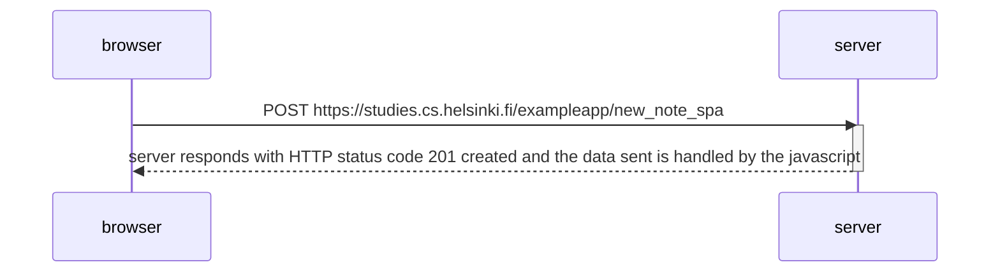

```mermaid
sequenceDiagram
    participant browser
    participant server

    browser->>server: POST https://studies.cs.helsinki.fi/exampleapp/new_note_spa
    activate server
    server-->>browser: server responds with HTTP status code 201 created and the data sent is handled by the javascript
    deactivate server

```